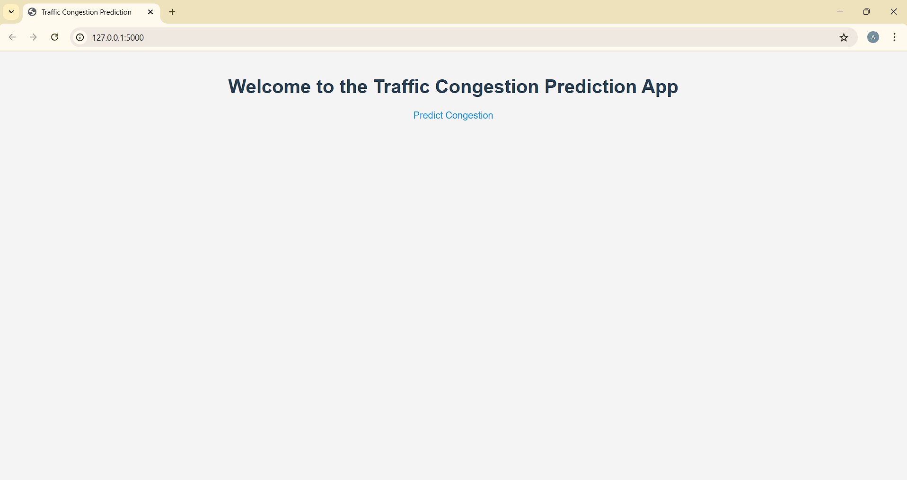

# Network Traffic Congestion Prediction

This project implements an end-to-end machine learning pipeline for predicting network traffic congestion.  It utilizes a Random Forest Classifier to analyze network traffic patterns and identify potential congestion points. This can be valuable for Internet Service Providers (ISPs) to proactively manage network resources and optimize performance.

## Table of Contents

- [Project Overview](#project-overview)
- [Project Structure](#project-structure)
- [Dataset](#dataset)
- [Methodology](#methodology)
- [Model Training and Evaluation](#model-training-and-evaluation)
- [Deployment](#deployment)
- [How to Run](#how-to-run)
- [Future Improvements](#future-improvements)
- [Dependencies](#dependencies)

## Project Overview

Network congestion can significantly impact user experience. This project aims to predict congestion levels based on various network traffic features. By accurately predicting congestion, ISPs can take preventive measures such as traffic shaping, load balancing, or infrastructure upgrades to ensure smooth service delivery. This project demonstrates a complete ML workflow, from data generation and exploration to model training, evaluation, and deployment.

## Project Structure

```
traffic_analysis/
├── README.md
├── requirements.txt
├── app.py           # Flask app for serving predictions
├── .venv            # Virtual environment (not included in repo)
├── .gitignore
├── config/
│   └── config.yaml  # Configuration file
├── data/
│   └── traffic_data.csv # Traffic data (generated)
├── models/
│   └── congestion_model.pkl # Trained model
│   └── scaler.pkl       # Scaler for preprocessing
│   └── X.pkl       # Data used for training
├── notebooks/
│   └── exploratory_data_analysis.ipynb # EDA notebook
├── logs/
│   └── (log files will go here)
├── visualization/
│   └── (visualized files will be saved here)
├── scripts/
│   └── run_pipeline.py # Script to run the entire pipeline
├── static/
│   └── styles.css   # CSS for web app
├── templates/
│   └── index.html   # Main page for the web app
│   └── predict.html # Prediction page
└── src/
├── init.py
├── utils/
│   ├── logger.py
│   └── init.py
├── data/
│   ├── generate_data.py
│   └── init.py
├── features/
│   ├── feature_engineering.py
│   └── init.py
├── models/
│   ├── train_model.py
│   ├── predict.py
│   └── init.py
└── visualization/
├── visualize.py
└── init.py
```

## Dataset

The project uses simulated network traffic data.  The data generation process incorporates realistic traffic patterns, including peak and off-peak hours, and simulates various network parameters like packet size, bytes sent, source/destination IPs, and protocols.  The `generate_data.py` script within the `src/data` directory is responsible for creating this dataset, which is then saved as `traffic_data.csv` in the `data/` directory.

## Methodology

1.  **Data Generation:** Simulated network traffic data is generated using NumPy and Pandas, considering realistic traffic patterns and correlations between variables.
2.  **Exploratory Data Analysis (EDA):**  The `exploratory_data_analysis.ipynb` notebook provides a comprehensive EDA, including data visualization, to understand the dataset's characteristics, identify potential features, and understand class imbalance.
3.  **Feature Engineering:**  IP addresses are converted to numerical representations, and new features like packet rate, mean packet size, total bytes sent, day of the week, and weekend indicator are engineered. One-hot encoding is applied to categorical features like protocol.
4.  **Feature Scaling:** Numerical features are standardized using StandardScaler to ensure optimal model performance.
5.  **Model Training:** A Random Forest Classifier is trained using TimeSeriesSplit cross-validation to account for the time-series nature of the data. RandomizedSearchCV is used to optimize hyperparameters like `n_estimators`, `max_depth`, `min_samples_split`, and `min_samples_leaf`.
6.  **Model Evaluation:** The model's performance is evaluated using metrics like classification report, confusion matrix, precision, recall, F1-score, and AUC-ROC. Feature importances are also analyzed.
7.  **Model Saving:** The trained model and the scaler are saved using pickle for later use in prediction.
8.  **Prediction Function:** The `predict_congestion` function in `src/models/predict.py` takes network traffic features as input, preprocesses them, and returns a congestion prediction.

## Model Training and Evaluation

The model training process utilizes TimeSeriesSplit cross-validation, which is crucial for time-series data to prevent data leakage and ensure reliable performance estimates. RandomizedSearchCV helps find the best hyperparameters for the Random Forest model. The evaluation metrics provide a comprehensive view of the model's predictive capabilities. Feature importance analysis helps understand which features are most influential in predicting congestion.

## Deployment

A simple Flask web application (`app.py`) is included to demonstrate how the trained model can be used for real-time predictions. The application provides an interface for users to input network traffic features and receive congestion predictions.

## How to Run

1.  **Clone the repository:**
    ```bash
    git clone <repository_url>
    ```
2.  **Create a virtual environment:**
    ```bash
    python3 -m venv .venv
    ```
3.  **Activate the virtual environment:**
    ```bash
    source .venv/bin/activate  # Linux/macOS
    .venv\Scripts\activate     # Windows
    ```
4.  **Install dependencies:**
    ```bash
    pip install -r requirements.txt
    ```
5.  **Generate data:**
    ```bash
    python src/data/generate_data.py
    ```
6.  **Run the training pipeline:**
    ```bash
    python scripts/run_pipeline.py
    ```
7.  **Run the Flask app:**
    ```bash
    python app.py
    ```
8.  **Open your browser:** Go to `http://127.0.0.1:5000` to access the web application.

## Project Output




## Future Improvements

-   **Real-time Data Integration:** Integrate with real-time network monitoring tools to collect traffic data automatically.
-   **Advanced Models:** Explore other machine learning models like Gradient Boosting or Deep Learning models for potentially higher accuracy.
-   **Feature Optimization:** Further refine feature engineering and selection to improve model performance.
-   **Web App Enhancements:**  Improve the web interface for better user experience and visualization of predictions.
-   **Model Monitoring:** Implement model monitoring to track performance and retrain as needed.
-   **CI/CD Pipeline:** Set up a CI/CD pipeline for automated testing and deployment.
-   **Bandwidth Allocation:** The congestion predictions can be integrated and used for dynamic bandwidth allocation, allowing ISPs to optimize network resource usage based on real-time congestion levels.

## Dependencies

-   pandas
-   numpy
-   scikit-learn
-   matplotlib
-   seaborn
-   ipaddress
-   Flask
-   pickle
-   pyyaml (if using config.yaml)